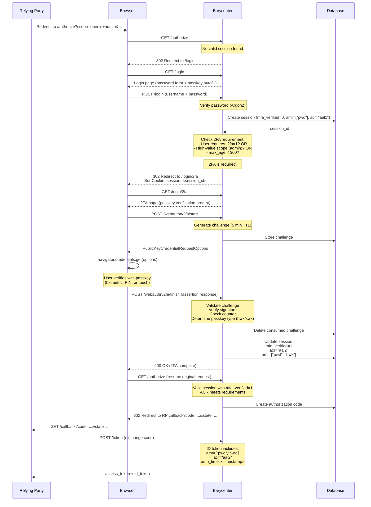

# 2FA Flow Walkthrough

This page provides a complete walkthrough of the two-factor authentication flow, from the initial authorization request through password login, passkey verification, session upgrade, and the final redirect back to the OAuth authorization endpoint.

## Complete Sequence



## Step-by-Step Breakdown

### 1. Authorization Request

The relying party redirects the user to Barycenter's authorization endpoint. The request may contain scopes or parameters that trigger 2FA:

```
GET /authorize?
  client_id=abc123&
  redirect_uri=https://app.example.com/callback&
  response_type=code&
  scope=openid+admin&
  code_challenge=E9Melhoa2OwvFrEMTJguCHaoeK1t8URWbuGJSstw-cM&
  code_challenge_method=S256&
  state=af0ifjsldkj
```

Barycenter finds no valid session and redirects to `/login`.

### 2. Password Authentication

The user submits their username and password. Barycenter:

- Verifies the password against the stored Argon2 hash.
- Creates a **partial session** in the database:

| Field          | Value       |
|----------------|-------------|
| `amr`          | `["pwd"]`   |
| `acr`          | `"aal1"`    |
| `mfa_verified` | `0`         |
| `auth_time`    | now         |

### 3. 2FA Requirement Check

Before redirecting back to `/authorize`, Barycenter checks whether 2FA is required by evaluating three conditions:

1. **User flag**: Is `users.requires_2fa = 1` for this user?
2. **Scope check**: Does the requested scope contain `admin`, `payment`, `transfer`, or `delete`?
3. **max_age check**: Is `max_age` present and less than 300?

In this example, the `admin` scope triggers condition 2. The user is redirected to `/login/2fa`.

### 4. Passkey 2FA Page

The `/login/2fa` page presents the user with a passkey verification prompt. This page uses the same WASM client as the login page but calls the 2FA-specific endpoints.

### 5. WebAuthn 2FA Start

The browser sends a request to begin the 2FA ceremony:

```
POST /webauthn/2fa/start
Cookie: session=<session_id>
```

This endpoint requires a **partial session** (a session with `mfa_verified = 0`). It generates a challenge, stores it with a 5-minute TTL, and returns `PublicKeyCredentialRequestOptions`.

The `allowCredentials` list is populated with the user's registered passkey IDs, since the user is already identified from the session.

### 6. Passkey Verification

The browser invokes the WebAuthn API:

```javascript
const assertion = await authenticate_passkey(options, "optional");
```

The user verifies their identity with a biometric, PIN, or security key touch.

### 7. WebAuthn 2FA Finish

The browser sends the signed assertion:

```
POST /webauthn/2fa/finish
Cookie: session=<session_id>
Content-Type: application/json

{ ... assertion response ... }
```

The server:

1. Retrieves and validates the challenge.
2. Identifies the passkey from the credential ID.
3. Verifies the signature against the stored public key.
4. Checks and updates the signature counter.
5. Determines the passkey type (`hwk` or `swk`) from the backup state.
6. Deletes the consumed challenge.

### 8. Session Upgrade

Upon successful verification, the existing session is **upgraded** (not replaced):

| Field          | Before          | After                |
|----------------|-----------------|----------------------|
| `amr`          | `["pwd"]`       | `["pwd", "hwk"]`    |
| `acr`          | `"aal1"`        | `"aal2"`             |
| `mfa_verified` | `0`             | `1`                  |
| `auth_time`    | (unchanged)     | (unchanged)          |

The `auth_time` is not updated because it records when the session was first created (the initial password authentication). The upgrade only changes the authentication strength fields.

### 9. Resume Authorization

The user is redirected back to `/authorize` with the original parameters. This time, Barycenter finds a valid session with `mfa_verified = 1` and proceeds to issue an authorization code.

### 10. Token Exchange

When the relying party exchanges the authorization code at the token endpoint, the resulting ID token includes the full authentication context:

```json
{
  "iss": "https://auth.example.com",
  "sub": "user_subject_uuid",
  "aud": "abc123",
  "exp": 1739560800,
  "iat": 1739557200,
  "auth_time": 1739557180,
  "amr": ["pwd", "hwk"],
  "acr": "aal2",
  "nonce": "..."
}
```

The relying party can verify that:

- `acr` is `"aal2"`, confirming two-factor authentication was performed.
- `amr` contains `"pwd"` and `"hwk"`, confirming the specific methods used.
- `auth_time` indicates when the authentication occurred.

## 2FA Endpoint vs Regular Authentication Endpoints

The 2FA endpoints differ from the regular passkey authentication endpoints:

| Aspect               | Regular Auth                         | 2FA                                 |
|----------------------|--------------------------------------|--------------------------------------|
| Start endpoint       | `POST /webauthn/authenticate/start`  | `POST /webauthn/2fa/start`          |
| Finish endpoint      | `POST /webauthn/authenticate/finish` | `POST /webauthn/2fa/finish`         |
| Auth required        | No (public)                          | Yes (partial session required)      |
| Creates new session  | Yes                                  | No (upgrades existing session)      |
| `allowCredentials`   | Empty (discoverable)                 | Populated with user's passkey IDs   |
| Resulting `acr`      | `"aal1"`                             | `"aal2"`                            |
