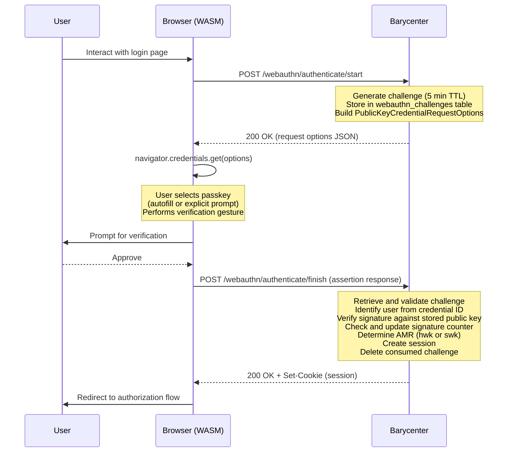

# Authenticating with a Passkey

Passkey authentication allows users to log in without a password by proving possession of a previously registered WebAuthn credential. This corresponds to the WebAuthn **assertion** ceremony.

## Endpoints

Both endpoints are **public** -- no existing session is required.

| Step   | Method | Path                              | Auth Required |
|--------|--------|-----------------------------------|---------------|
| Start  | `POST` | `/webauthn/authenticate/start`    | No            |
| Finish | `POST` | `/webauthn/authenticate/finish`   | No            |

## Authentication Flow



## Step 1: Start Authentication

The client initiates authentication by requesting a challenge:

```
POST /webauthn/authenticate/start
Content-Type: application/json
```

The server responds with `PublicKeyCredentialRequestOptions`:

```json
{
  "publicKey": {
    "challenge": "<base64url-encoded random challenge>",
    "timeout": 300000,
    "rpId": "auth.example.com",
    "userVerification": "preferred",
    "allowCredentials": []
  }
}
```

Note that `allowCredentials` is empty for discoverable credential flows. The authenticator itself determines which credentials are available for the given RP ID. This enables passkey autofill via [Conditional UI](./conditional-ui.md).

## Step 2: Browser Credential Assertion

The WASM client passes the options to the browser's WebAuthn API:

```javascript
const assertion = await authenticate_passkey(requestOptions, "conditional");
```

The second argument controls the mediation behavior:

| Mediation Value | Behavior                                                |
|-----------------|---------------------------------------------------------|
| `"conditional"` | Credentials appear in the browser's autofill dropdown.  |
| `"optional"`    | A modal dialog prompts the user to select a credential. |

The authenticator signs the challenge with the private key corresponding to the selected credential.

## Step 3: Finish Authentication

The WASM client sends the signed assertion to the server:

```
POST /webauthn/authenticate/finish
Content-Type: application/json

{
  "id": "<credential ID>",
  "rawId": "<base64url-encoded raw credential ID>",
  "type": "public-key",
  "response": {
    "clientDataJSON": "<base64url-encoded>",
    "authenticatorData": "<base64url-encoded>",
    "signature": "<base64url-encoded>",
    "userHandle": "<base64url-encoded user handle>"
  }
}
```

The server performs the following steps:

1. **Retrieve the challenge** from the `webauthn_challenges` table and verify it has not expired.
2. **Identify the user** by looking up the credential ID in the `passkeys` table.
3. **Verify the signature** against the stored public key.
4. **Check the signature counter** to detect potential authenticator cloning. If the counter has not advanced as expected, authentication may be rejected.
5. **Update the signature counter** in the stored passkey record.
6. **Determine the AMR value** based on the passkey's backup state.
7. **Create a new session** and set the session cookie.
8. **Delete the consumed challenge**.

## AMR Assignment

The AMR (Authentication Methods Reference) value is determined by the passkey's `backup_eligible` flag:

| Backup Eligible | AMR Value | Meaning                                       |
|-----------------|-----------|-----------------------------------------------|
| `false`         | `hwk`     | Hardware-bound key that cannot be synced.      |
| `true`          | `swk`     | Software/cloud key that may be synced.         |

This classification is checked on every authentication, not just at registration time, because the backup state can change (for example, when an OS update enables cloud sync for a previously local credential).

## Session Created

After successful passkey authentication, the new session contains:

| Field          | Value                                 |
|----------------|---------------------------------------|
| `amr`          | `["hwk"]` or `["swk"]`               |
| `acr`          | `"aal1"` (single-factor)             |
| `mfa_verified` | `0`                                   |
| `auth_time`    | Current UTC timestamp                 |

The session is single-factor (`aal1`) because only one authentication method was used. If the authorization request requires two-factor authentication, the user will be redirected to complete a second factor. See [Two-Factor Authentication](./two-factor.md).

## Signature Counter and Clone Detection

WebAuthn authenticators maintain a monotonically increasing signature counter. Each time the authenticator is used, the counter increments. Barycenter stores and checks this counter to detect cloned authenticators:

- If the assertion's counter is **greater than** the stored counter, authentication succeeds and the stored counter is updated.
- If the counter is **less than or equal to** the stored counter (and not zero), this may indicate the authenticator has been cloned. Barycenter logs a warning; the behavior is configurable.

Note that some authenticators (particularly cloud-synced passkeys) always report a counter of zero, which effectively disables clone detection for those credentials.

## Error Cases

| Scenario                           | HTTP Status | Description                                        |
|------------------------------------|-------------|----------------------------------------------------|
| Challenge expired or not found     | `400`       | The 5-minute window has elapsed; restart the flow. |
| Credential not found               | `400`       | No passkey matches the provided credential ID.     |
| Signature verification failed      | `400`       | The signed response did not validate.              |
| Signature counter regression       | `400`       | Possible authenticator cloning detected.           |
