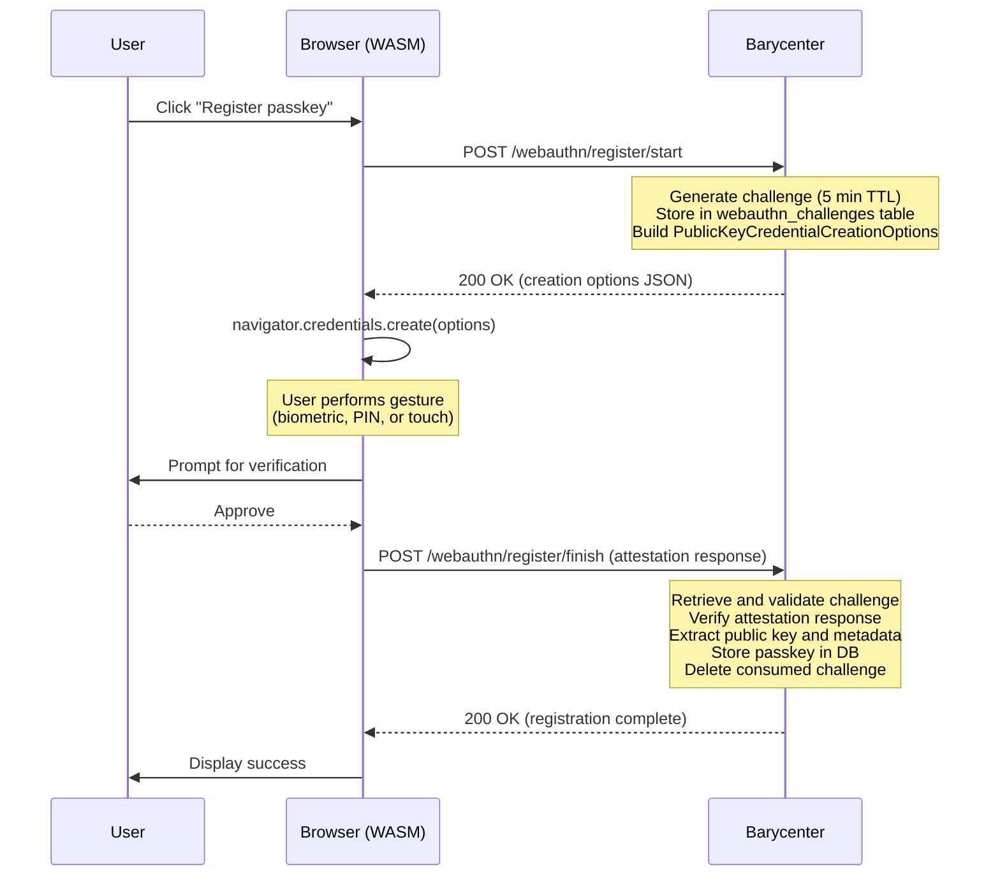

# Registering a Passkey

Passkey registration is the process of creating a new WebAuthn credential and associating it with the user's account. This corresponds to the WebAuthn **attestation** ceremony.

## Prerequisites

- The user must have an **active session** (i.e., they must be logged in). Registration endpoints are not public.
- The browser must support the WebAuthn API (`supports_webauthn()` returns `true`).
- The WASM client module must be loaded.

## Endpoints

| Step   | Method | Path                        | Auth Required |
|--------|--------|-----------------------------|---------------|
| Start  | `POST` | `/webauthn/register/start`  | Yes (session) |
| Finish | `POST` | `/webauthn/register/finish` | Yes (session) |

## Registration Flow



## Step 1: Start Registration

The client sends a POST request to begin registration. No request body is needed; the server identifies the user from the session cookie.

```
POST /webauthn/register/start
Cookie: session=<session_id>
```

The server responds with `PublicKeyCredentialCreationOptions` in JSON:

```json
{
  "publicKey": {
    "rp": {
      "name": "Barycenter",
      "id": "auth.example.com"
    },
    "user": {
      "id": "<base64url-encoded user handle>",
      "name": "alice",
      "displayName": "Alice"
    },
    "challenge": "<base64url-encoded random challenge>",
    "pubKeyCredParams": [
      { "type": "public-key", "alg": -7 },
      { "type": "public-key", "alg": -257 }
    ],
    "timeout": 300000,
    "authenticatorSelection": {
      "residentKey": "preferred",
      "userVerification": "preferred"
    },
    "excludeCredentials": [
      {
        "type": "public-key",
        "id": "<existing credential ID>"
      }
    ]
  }
}
```

Key fields:

| Field                  | Description                                                              |
|------------------------|--------------------------------------------------------------------------|
| `rp.id`               | Relying Party ID, derived from the issuer URL host.                      |
| `challenge`           | Random challenge stored with a 5-minute TTL.                             |
| `pubKeyCredParams`    | Supported algorithms: ES256 (`-7`) and RS256 (`-257`).                   |
| `excludeCredentials`  | IDs of the user's existing passkeys to prevent duplicate registration.   |
| `authenticatorSelection` | Preferences for discoverable credentials and user verification.       |

## Step 2: Browser Credential Creation

The WASM client passes the options to the browser's WebAuthn API:

```javascript
const credential = await register_passkey(creationOptions);
```

This triggers `navigator.credentials.create()`, which prompts the user to verify their identity with a biometric, PIN, or security key touch. The authenticator then:

1. Generates a new public/private key pair.
2. Stores the private key internally.
3. Returns the public key, credential ID, and attestation data.

## Step 3: Finish Registration

The WASM client sends the attestation response to the server:

```
POST /webauthn/register/finish
Cookie: session=<session_id>
Content-Type: application/json

{
  "id": "<credential ID>",
  "rawId": "<base64url-encoded raw credential ID>",
  "type": "public-key",
  "response": {
    "clientDataJSON": "<base64url-encoded>",
    "attestationObject": "<base64url-encoded>"
  }
}
```

The server performs the following validation:

1. **Retrieve the challenge** from the `webauthn_challenges` table and verify it has not expired.
2. **Verify the attestation response** including origin, RP ID, and challenge match.
3. **Extract credential data**: public key, credential ID, signature counter, and backup state.
4. **Store the passkey** as a full `Passkey` JSON object in the database, associated with the user.
5. **Delete the consumed challenge** to enforce single-use.

## Passkey Storage

Each registered passkey is stored with the following data:

| Field              | Description                                                      |
|--------------------|------------------------------------------------------------------|
| `credential_id`   | Unique identifier for the credential (base64url-encoded).        |
| `user_subject`    | The subject identifier of the owning user.                       |
| `passkey_json`    | Full `Passkey` object serialized as JSON (public key, counters). |
| `friendly_name`   | Optional user-assigned name (e.g., "Work YubiKey").              |
| `backup_eligible` | Whether the credential can be synced across devices.             |
| `created_at`      | Timestamp of registration.                                       |

## Challenge Expiration

The challenge generated during the start step has a **5-minute TTL**. If the user does not complete the registration within this window, the challenge expires and the ceremony must be restarted. A background job cleans up expired challenges every 5 minutes.

## Error Cases

| Scenario                           | HTTP Status | Description                                        |
|------------------------------------|-------------|----------------------------------------------------|
| No active session                  | `401`       | User must log in before registering a passkey.     |
| Challenge expired or not found     | `400`       | The 5-minute window has elapsed; restart the flow. |
| Attestation verification failed    | `400`       | The authenticator response did not pass validation.|
| Credential already registered      | `409`       | The credential ID is already associated with the user. |
