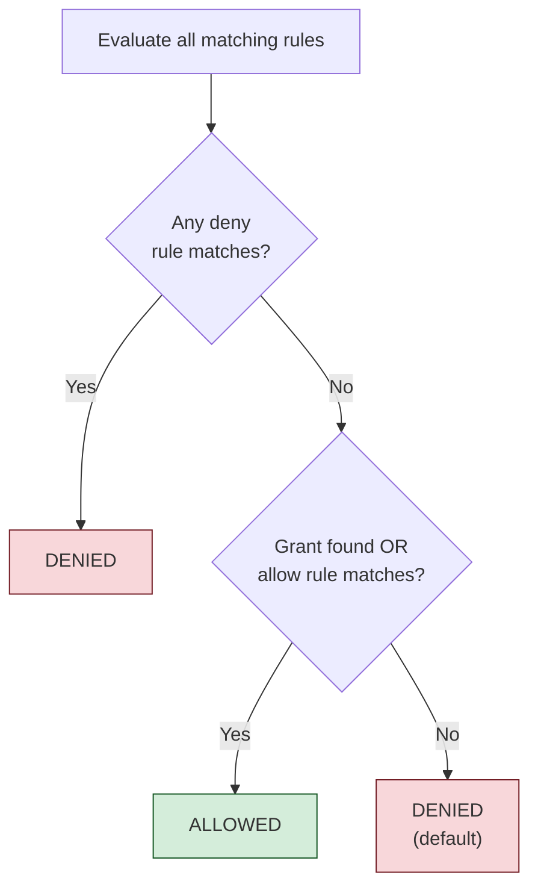

# ABAC Rules and Conditions

A `rule` node defines an Attribute-Based Access Control (ABAC) policy that can allow or deny access based on contextual attributes provided at evaluation time. Rules complement the relationship-based [grants](./grants-tuples.md) model by adding conditional logic that depends on dynamic properties such as time of day, IP address, or application-specific metadata.

## Syntax

```kdl
rule "<rule_name>" effect="<allow|deny>" {
    permissions {
        - "<resource_type>:<permission_name>"
        // ...
    }
    principals {
        - "<principal_pattern>"
        // ...
    }
    condition "<expression>"
}
```

### Components

| Component | Required | Description |
|-----------|----------|-------------|
| `rule_name` | Yes | A descriptive identifier for this rule. Used in logging and debugging. |
| `effect` | Yes | The action to take when the rule matches: `"allow"` or `"deny"`. |
| `permissions` | Yes | Fully-qualified permissions that this rule applies to. |
| `principals` | Yes | Principal patterns that this rule applies to. |
| `condition` | No | A boolean expression evaluated against the request context. If omitted, the rule applies unconditionally when the permissions and principals match. |

## Effect: Allow vs. Deny

The `effect` attribute determines what happens when a rule matches:

| Effect | Behavior |
|--------|----------|
| `allow` | Grants access to the specified permissions for the matched principals, subject to the condition. Acts as an alternative to grant-based access. |
| `deny` | Blocks access regardless of any matching grants or allow rules. Deny rules always take precedence. |

The authorization engine follows a **deny-overrides** evaluation strategy:

1. If any `deny` rule matches, the request is denied.
2. If a grant or an `allow` rule matches, the request is allowed.
3. If nothing matches, the request is denied (default deny).



## Permissions Block

The `permissions` block lists the fully-qualified permissions that this rule applies to. A rule is only evaluated for check requests whose requested permission appears in this list.

```kdl
rule "AllowReadDuringBusinessHours" effect="allow" {
    permissions {
        - "document:read"
        - "document:list"
    }
    // ...
}
```

The permission format is the same as in [role definitions](./roles-inheritance.md): `resource_type:permission_name`.

## Principals Block

The `principals` block specifies which principals the rule applies to. Each entry is a pattern that is matched against the principal in the check request.

```kdl
rule "DenyContractorDeleteAccess" effect="deny" {
    permissions {
        - "document:delete"
        - "project:delete"
    }
    principals {
        - "group:contractors"
    }
    // ...
}
```

### Principal Patterns

| Pattern | Matches | Example |
|---------|---------|---------|
| `"*"` | All principals | Applies to everyone |
| `"user:alice"` | A specific user | Only the principal `user/alice` |
| `"group:engineering"` | A specific group | Principals in the `engineering` group |
| `"service:*"` | All service accounts | Any principal with type `service` |

The wildcard `"*"` is useful for rules that should apply universally, such as time-based restrictions or global deny policies:

```kdl
rule "DenyAllAccessDuringMaintenance" effect="deny" {
    permissions {
        - "vm:start"
        - "vm:stop"
        - "vm:delete"
    }
    principals {
        - "*"
    }
    condition "request.context.maintenance_mode == true"
}
```

## Condition Expressions

The `condition` attribute contains a boolean expression that is evaluated against the context JSON object provided in the check request. If the condition evaluates to `true`, the rule's effect is applied. If it evaluates to `false`, the rule is skipped.

### Context Object

The context is provided in the check request body:

```json
{
    "principal": "user/alice",
    "permission": "document:write",
    "resource": "document/q4-report",
    "context": {
        "request": {
            "time": {
                "hour": 14,
                "day_of_week": "Tuesday"
            },
            "ip": "10.0.1.42",
            "source": "internal"
        },
        "environment": {
            "maintenance_mode": false,
            "region": "us-east-1"
        }
    }
}
```

### Expression Syntax

Condition expressions support standard comparison and logical operators:

| Category | Operators | Example |
|----------|-----------|---------|
| Comparison | `==`, `!=`, `<`, `>`, `<=`, `>=` | `request.time.hour >= 9` |
| Logical | `&&`, `\|\|`, `!` | `request.time.hour >= 9 && request.time.hour < 17` |
| Grouping | `(` `)` | `(a > 1) \|\| (b < 2)` |
| String equality | `==`, `!=` | `request.source == "internal"` |
| Boolean | `== true`, `== false` | `environment.maintenance_mode == true` |

Expressions use dot notation to traverse the context JSON object. For example, `request.time.hour` accesses the `hour` field nested under `request.time` in the context.

### Expression Examples

**Time-based restrictions:**

```kdl
// Only allow during business hours (9 AM to 5 PM)
condition "request.time.hour >= 9 && request.time.hour < 17"

// Deny on weekends
condition "request.time.day_of_week == \"Saturday\" || request.time.day_of_week == \"Sunday\""
```

**Network-based restrictions:**

```kdl
// Only allow from internal network
condition "request.source == \"internal\""

// Deny from specific regions
condition "environment.region != \"us-restricted-1\""
```

**Feature flags and operational controls:**

```kdl
// Block during maintenance
condition "environment.maintenance_mode == true"

// Only allow when feature is enabled
condition "environment.feature_flags.new_dashboard == true"
```

## Complete Rule Examples

### Business Hours Restriction

Allow a group of contractors to access invoices only during business hours:

```kdl
rule "AllowFinanceViewDuringBusinessHours" effect="allow" {
    permissions {
        - "invoice:view"
        - "invoice:list"
    }
    principals {
        - "group:finance"
    }
    condition "request.time.hour >= 9 && request.time.hour < 17"
}
```

### Maintenance Window Lockout

Deny all destructive operations during maintenance windows:

```kdl
rule "DenyDestructiveDuringMaintenance" effect="deny" {
    permissions {
        - "vm:stop"
        - "vm:delete"
        - "vm:resize"
        - "document:delete"
        - "project:delete"
    }
    principals {
        - "*"
    }
    condition "environment.maintenance_mode == true"
}
```

### Environment-Based Access Tiers

Restrict production access to senior engineers:

```kdl
rule "DenyProductionForJuniors" effect="deny" {
    permissions {
        - "vm:start"
        - "vm:stop"
        - "vm:delete"
    }
    principals {
        - "group:junior-engineers"
    }
    condition "request.resource_environment == \"production\""
}
```

### Unconditional Deny

A rule without a condition acts as an unconditional policy. This is useful for hard access boundaries:

```kdl
rule "DenyContractorDelete" effect="deny" {
    permissions {
        - "document:delete"
        - "project:delete"
        - "workspace:delete"
    }
    principals {
        - "group:contractors"
    }
}
```

This rule denies delete operations for contractors regardless of any context, grants, or other allow rules.

## Combining Rules with Grants

Rules and grants work together in the evaluation pipeline. A common pattern is to use grants for the baseline access model and rules for contextual restrictions:

```kdl
// Baseline: Alice is a VM admin (via grant)
grant "vm_admin" on="vm/prod-web-1" to="user/alice"

// Restriction: Nobody can delete VMs during maintenance (via rule)
rule "DenyDeleteDuringMaintenance" effect="deny" {
    permissions {
        - "vm:delete"
    }
    principals {
        - "*"
    }
    condition "environment.maintenance_mode == true"
}
```

Even though Alice has `vm_admin` (which includes `vm:delete`), the deny rule blocks deletion during maintenance. When maintenance mode is off, Alice's grant-based access works normally.

## Evaluation Order

Rules are evaluated in the order they appear in the policy files, but the order does not affect the final result because deny-overrides is applied as a set operation:

1. All rules matching the requested permission are collected.
2. Each rule's principal pattern is checked against the requesting principal.
3. Each matching rule's condition is evaluated against the provided context.
4. If **any** deny rule matches, the result is deny.
5. If **any** allow rule matches (and no deny rule matched), the result is allow.

This means you cannot "override" a deny rule with a later allow rule. Deny is always final.

## Further Reading

- [Overview](./overview.md) -- the complete evaluation pipeline
- [Grants and Relationship Tuples](./grants-tuples.md) -- the ReBAC grant model that rules augment
- [Authz REST API](./rest-api.md) -- passing context in check requests
- [Configuration and Deployment](./configuration.md) -- file organization and loading
