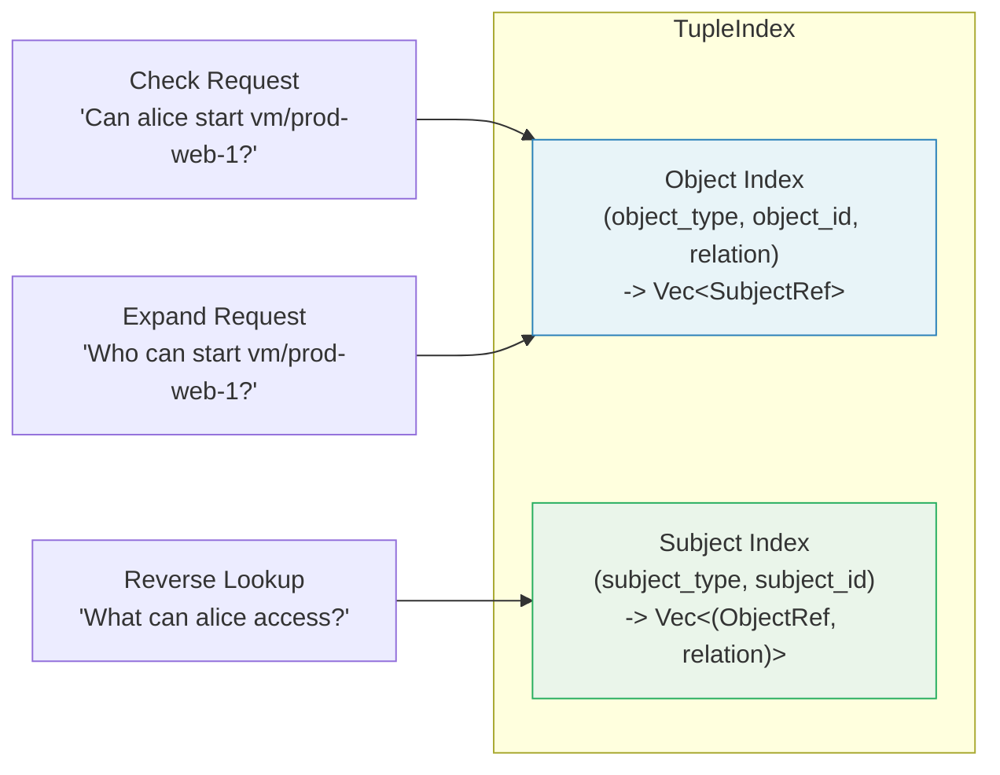

# Grants and Relationship Tuples

A `grant` node creates a relationship tuple that assigns a [role](./roles-inheritance.md) to a principal on a specific [resource](./resources-permissions.md) instance. Grants are the data layer of the authorization model -- they answer the question "who has what role on which object?"

## Syntax

```kdl
grant "<role_name>" on="<object_ref>" to="<subject_ref>"
```

A grant is a single-line KDL node with three components:

| Component | Format | Description |
|-----------|--------|-------------|
| `role_name` | String argument | The name of a role defined by a `role` node. |
| `on` | `type/id` (ObjectRef) | The resource instance that the grant applies to. |
| `to` | `type/id` or `type/id#relation` (SubjectRef) | The principal receiving the role, optionally with a userset qualifier. |

## Object References (ObjectRef)

The `on` attribute uses the **ObjectRef** format to identify a specific resource instance:

```
<resource_type>/<instance_id>
```

| ObjectRef | Resource Type | Instance ID |
|-----------|--------------|-------------|
| `vm/prod-web-1` | `vm` | `prod-web-1` |
| `document/q4-report` | `document` | `q4-report` |
| `project/barycenter` | `project` | `barycenter` |
| `workspace/acme-corp` | `workspace` | `acme-corp` |

The resource type must match a `resource` node declared in the policy files. The instance ID is an opaque string -- it can be a UUID, a slug, a numeric ID, or any identifier your application uses.

## Subject References (SubjectRef)

The `to` attribute identifies the principal receiving the role. Subject references come in two forms:

### Direct Subject

A direct subject reference identifies a single principal:

```
<subject_type>/<subject_id>
```

```kdl
grant "vm_admin" on="vm/prod-web-1" to="user/alice"
grant "vm_viewer" on="vm/prod-web-1" to="service/monitoring-agent"
```

The subject type is not restricted to `user` -- it can be any type that makes sense in your domain:

| Subject Type | Example | Use Case |
|-------------|---------|----------|
| `user` | `user/alice` | Individual human users |
| `service` | `service/monitoring` | Machine-to-machine principals |
| `bot` | `bot/deploy-agent` | Automated agents |
| `team` | `team/sre` | Organizational units (direct assignment) |

### Userset Subject

A userset subject reference delegates the grant to all members of a group or relation:

```
<subject_type>/<subject_id>#<relation>
```

```kdl
grant "vm_viewer" on="vm/prod-web-1" to="group/sre#member"
grant "document_editor" on="document/q4-report" to="team/finance#lead"
```

The `#relation` suffix means "all entities that have the specified relation to this subject." For example, `group/sre#member` means "all members of the SRE group."

This is a key building block for scaling authorization. Instead of granting roles to every individual user, you grant roles to a group's membership and manage who belongs to the group separately.

### Userset Example

Consider a scenario where you want all members of the engineering team to view a VM:

```kdl
// Grant the vm_viewer role to all members of the engineers group
grant "vm_viewer" on="vm/staging-1" to="group/engineers#member"
```

When evaluating a check request for `user/bob` on `vm/staging-1`, the engine will:

1. Look up grants on `vm/staging-1`.
2. Find the grant to `group/engineers#member`.
3. Check whether `user/bob` has the `member` relation to `group/engineers`.
4. If yes, the grant applies and Bob holds the `vm_viewer` role on `vm/staging-1`.

## Tuple Index

Grants are stored in an in-memory `TupleIndex` structure that supports efficient lookup from two directions:



### Object Index

The primary index is keyed by `(object_type, object_id, relation)` and returns a list of subjects that hold that relation on that object. This index is used during permission checks:

**Lookup**: Given a permission and resource, the engine finds all roles that grant the permission (via the pre-computed `permission_roles` map), then queries the object index for each role on the specified resource to find matching subjects.

### Subject Index

The secondary index is keyed by `(subject_type, subject_id)` and returns a list of `(ObjectRef, relation)` pairs. This index supports reverse lookups -- finding all resources that a given subject has access to.

### Index Construction

Both indexes are built once during policy loading. Each `grant` node produces entries in both indexes:

```kdl
grant "vm_admin" on="vm/prod-web-1" to="user/alice"
```

Produces:

- **Object index entry**: `("vm", "prod-web-1", "vm_admin")` -> `[SubjectRef("user/alice")]`
- **Subject index entry**: `("user", "alice")` -> `[(ObjectRef("vm/prod-web-1"), "vm_admin")]`

## Examples

### Per-User Access

Direct role assignment to individual users:

```kdl
grant "vm_admin" on="vm/prod-web-1" to="user/alice"
grant "vm_admin" on="vm/prod-web-2" to="user/alice"
grant "vm_viewer" on="vm/prod-web-1" to="user/bob"
grant "vm_operator" on="vm/staging-1" to="user/charlie"
```

### Group-Based Access

Using userset references to grant roles to group members:

```kdl
// All SRE team members can operate production VMs
grant "vm_operator" on="vm/prod-web-1" to="group/sre#member"
grant "vm_operator" on="vm/prod-web-2" to="group/sre#member"
grant "vm_operator" on="vm/prod-db-1" to="group/sre#member"

// All engineering members can view staging VMs
grant "vm_viewer" on="vm/staging-1" to="group/engineering#member"
grant "vm_viewer" on="vm/staging-2" to="group/engineering#member"
```

### Mixed Access Patterns

Combining direct and group-based grants for the same resource:

```kdl
// Alice owns the document
grant "document_owner" on="document/architecture-rfc" to="user/alice"

// The platform team can edit it
grant "document_editor" on="document/architecture-rfc" to="team/platform#member"

// Everyone in engineering can read it
grant "document_viewer" on="document/architecture-rfc" to="group/engineering#member"
```

### Service Accounts

Granting roles to non-human principals:

```kdl
// Monitoring service can view all production VMs
grant "vm_viewer" on="vm/prod-web-1" to="service/prometheus"
grant "vm_viewer" on="vm/prod-web-2" to="service/prometheus"
grant "vm_viewer" on="vm/prod-db-1" to="service/prometheus"

// Deploy agent can operate staging VMs
grant "vm_operator" on="vm/staging-1" to="service/deploy-agent"
```

## How Grants Are Evaluated

During a permission check, the engine follows this sequence:

1. **Map permission to roles**: Look up the requested permission (e.g., `vm:start`) in the `permission_roles` map to find all roles that grant it (e.g., `["vm_operator", "vm_admin"]`).

2. **Query the object index**: For each matching role, query the tuple index for the requested resource (e.g., all subjects with `vm_operator` or `vm_admin` on `vm/prod-web-1`).

3. **Match the principal**: Check whether the requesting principal appears in the returned subjects, either as a direct match or through a userset reference.

4. **Return result**: If a match is found, the grant contributes an "allow" signal to the evaluation pipeline. ABAC rules may still override the result (see [Overview](./overview.md) for the full pipeline).

## Further Reading

- [Resources and Permissions](./resources-permissions.md) -- declaring resource types referenced in ObjectRefs
- [Roles and Inheritance](./roles-inheritance.md) -- defining the roles referenced in grants
- [ABAC Rules and Conditions](./abac-rules.md) -- conditional policies that can override grant-based access
- [Authz REST API](./rest-api.md) -- the `/v1/check` and `/v1/expand` endpoints that evaluate grants
