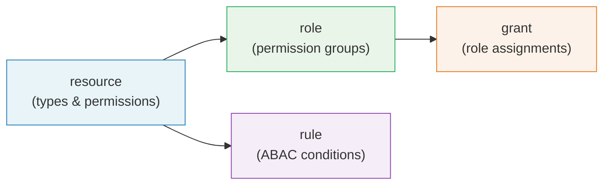

# KDL Policy Language

Barycenter's authorization policies are written in [KDL](https://kdl.dev/) (KDL Document Language), a node-based configuration language that provides a clean, readable syntax for expressing access control rules. Policy files use the `.kdl` extension and are loaded from the configured `policies_dir` directory at startup.

## Why KDL?

KDL strikes a balance between the simplicity of TOML and the expressiveness of HCL. Its node-based structure maps naturally to the concepts in an authorization policy: resources have child nodes for relations and permissions, roles contain permission lists, and grants are single-line declarations with named attributes.

Key advantages for policy authoring:

- **Readable**: Node names (`resource`, `role`, `grant`, `rule`) read as natural-language declarations.
- **Structured**: Child blocks group related configuration without deeply nested braces.
- **Comments**: KDL supports `//` line comments and `/* */` block comments for documenting policy intent.
- **Familiar**: The syntax will feel natural to anyone who has worked with CSS, HCL, or similar formats.

## The Four Node Types

Every policy file is composed of four types of top-level nodes. Each node type serves a distinct role in the authorization model:



### resource

A `resource` node declares a type of object in your system, along with the relations and permissions that apply to it. Resources are the foundation of the policy model -- they define _what_ can be acted upon and _what actions_ exist.

```kdl
resource "document" {
    relations {
        - "owner"
        - "editor"
        - "viewer"
    }
    permissions {
        - "read"
        - "write"
        - "delete"
        - "share"
    }
}
```

See [Resources and Permissions](./resources-permissions.md) for full syntax and examples.

### role

A `role` node groups permissions together and optionally inherits from other roles. Roles use fully-qualified permission names in the format `type:permission` to reference the permissions declared on resources.

```kdl
role "document_viewer" {
    permissions {
        - "document:read"
    }
}

role "document_editor" {
    includes {
        - "document_viewer"
    }
    permissions {
        - "document:write"
        - "document:share"
    }
}
```

See [Roles and Inheritance](./roles-inheritance.md) for details on composition and inheritance chains.

### grant

A `grant` node creates a relationship tuple that assigns a role to a principal on a specific resource instance. Grants are the data layer of the authorization model -- they express _who_ has _what role_ on _which object_.

```kdl
grant "document_editor" on="document/quarterly-report" to="user/alice"
grant "document_viewer" on="document/quarterly-report" to="group/accounting#member"
```

See [Grants and Relationship Tuples](./grants-tuples.md) for the full reference syntax and tuple indexing.

### rule

A `rule` node defines an attribute-based policy with a condition expression. Rules can allow or deny access based on properties of the request context, such as the current time, IP address, or custom attributes.

```kdl
rule "RestrictEditingToBusinessHours" effect="allow" {
    permissions {
        - "document:write"
    }
    principals {
        - "group:contractors"
    }
    condition "request.time.hour >= 9 && request.time.hour < 17"
}
```

See [ABAC Rules and Conditions](./abac-rules.md) for the complete rule syntax and condition language.

## File Organization

All `.kdl` files in the `policies_dir` directory are loaded and merged at startup. There is no required file naming convention, but a common pattern is to organize by resource type or domain:

```
policies/
  resources.kdl       # resource type definitions
  roles.kdl           # role definitions with inheritance
  grants-team-a.kdl   # grants for team A
  grants-team-b.kdl   # grants for team B
  rules.kdl           # ABAC rules and conditions
```

You can also put everything in a single file, or split it however makes sense for your organization. The engine merges all files into a single `AuthzState` before building its indexes.

### Loading Order

Files are loaded in alphabetical order, but the order does not affect evaluation semantics. All nodes are collected and indexed together. However, there are dependencies between node types:

| Node Type | May Reference |
|-----------|--------------|
| `resource` | Nothing (standalone declarations) |
| `role` | Permissions from `resource` nodes, other `role` nodes via `includes` |
| `grant` | `role` names, resource types and IDs |
| `rule` | Permissions from `resource` nodes |

If a role references a permission that does not exist on any resource, or a grant references an undefined role, the engine will log a warning at startup. Malformed references do not prevent loading but will never match during evaluation.

## Immutability

Policies are immutable after loading. The `AuthzState` structure that holds all resources, roles, rules, and tuple indexes is built once during startup and shared as read-only state across all request handlers.

To change policies:

1. Edit the `.kdl` files in `policies_dir`.
2. Commit the changes to version control.
3. Restart (or reload) the Barycenter service.

This design ensures that policy evaluation is lock-free and that all authorization decisions during a given process lifetime are consistent. It also makes policy changes fully auditable through your version control system.

## Example: Complete Policy File

Here is a minimal but complete policy file that demonstrates all four node types working together:

```kdl
// Define a resource type for virtual machines
resource "vm" {
    relations {
        - "owner"
        - "viewer"
    }
    permissions {
        - "start"
        - "stop"
        - "view_console"
    }
}

// Define roles with inheritance
role "vm_viewer" {
    permissions {
        - "vm:view_console"
    }
}

role "vm_admin" {
    includes {
        - "vm_viewer"
    }
    permissions {
        - "vm:start"
        - "vm:stop"
    }
}

// Assign roles to users and groups
grant "vm_admin" on="vm/prod-web-1" to="user/alice"
grant "vm_viewer" on="vm/prod-web-1" to="group/sre#member"

// Restrict stop operations to business hours
rule "AllowStopDuringBusinessHoursOnly" effect="deny" {
    permissions {
        - "vm:stop"
    }
    principals {
        - "*"
    }
    condition "request.time.hour < 6 || request.time.hour >= 22"
}
```

With this policy loaded, the check request `{ principal: "user/alice", permission: "vm:start", resource: "vm/prod-web-1" }` would be allowed (Alice has `vm_admin` which includes `vm:start`), while `{ principal: "user/alice", permission: "vm:stop", resource: "vm/prod-web-1", context: { "request.time.hour": 23 } }` would be denied by the ABAC rule.

## Further Reading

- [Resources and Permissions](./resources-permissions.md)
- [Roles and Inheritance](./roles-inheritance.md)
- [Grants and Relationship Tuples](./grants-tuples.md)
- [ABAC Rules and Conditions](./abac-rules.md)
