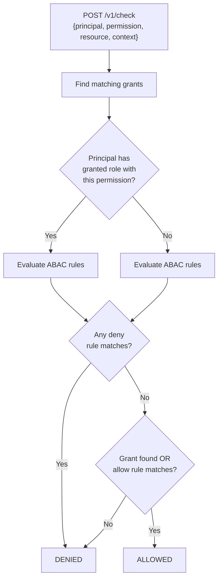

# Overview

Barycenter includes a built-in authorization policy engine that evaluates access control decisions at runtime. The engine combines Relationship-Based Access Control (ReBAC) with Attribute-Based Access Control (ABAC) into a single evaluation pipeline, all configured through a declarative KDL-based policy language.

## What It Does

The authorization engine answers one question: **is this principal allowed to perform this action on this resource?** It does so by loading policies from `.kdl` files at startup, building an in-memory index of grants, roles, and rules, and exposing a REST API that services can call to check permissions.

Unlike external policy engines such as Open Policy Agent or SpiceDB, Barycenter's authorization engine runs inside the same process as the identity provider. This eliminates network hops for authorization decisions and simplifies deployment for teams that need both authentication and authorization in a single binary.

## Design Principles

- **Declarative policies**: All access control logic is expressed in KDL files, not application code.
- **Immutable at runtime**: Policies are loaded once at startup and cannot be modified without restarting the service. This guarantees consistent evaluation and makes policy changes auditable through version control.
- **Hybrid model**: ReBAC (grants and roles) handles structural relationships such as "Alice is an admin of VM-123." ABAC (rules with conditions) handles contextual decisions such as "allow access only during business hours."
- **Separate network surface**: The authorization API runs on its own port, isolated from both the public OIDC endpoints and the admin GraphQL API.

## How It Fits Into Barycenter

The authorization engine is the third server in Barycenter's [three-port architecture](../getting-started/architecture.md):

| Server | Default Port | Purpose |
|--------|-------------|---------|
| Public OIDC | 8080 | User-facing authentication and OAuth flows |
| Admin GraphQL | 8081 | Internal management and job control |
| **Authorization** | **8082** | **Policy evaluation API** |

All three servers share the same process, database connection pool, and application state. The authorization engine is optional -- it is only started when explicitly enabled in the configuration.

## Policy Evaluation Flow

When a service sends a check request to the authorization engine, the following evaluation pipeline runs:



The evaluation proceeds in three stages:

1. **Grant lookup**: The engine searches the tuple index for grants that connect the principal to the requested resource with a role that includes the requested permission. Role inheritance is resolved transitively -- if `vm_admin` includes `vm_viewer`, a principal granted `vm_admin` also holds all `vm_viewer` permissions.

2. **ABAC rule evaluation**: All rules whose permissions list matches the requested permission are evaluated. Each rule specifies an effect (`allow` or `deny`), a set of principals, and an optional condition expression. The condition is evaluated against the context JSON provided in the request.

3. **Decision**: If any `deny` rule matches, the request is denied regardless of grants. If a matching grant was found or an `allow` rule matches, the request is allowed. Otherwise, it is denied by default.

This means the engine follows a **deny-overrides** strategy: explicit deny rules always take precedence over grants and allow rules.

## Enabling the Authorization Engine

The engine is disabled by default. To enable it, add the following to your configuration file:

```toml
[authz]
enabled = true
```

See [Configuration and Deployment](./configuration.md) for the full set of configuration options.

## Policy Language at a Glance

Policies are written in [KDL](https://kdl.dev/), a document language designed for configuration files. Barycenter's policy language defines four node types:

| Node Type | Purpose | Example |
|-----------|---------|---------|
| [`resource`](./resources-permissions.md) | Declares a resource type with its relations and permissions | `resource "vm" { ... }` |
| [`role`](./roles-inheritance.md) | Groups permissions and supports inheritance | `role "vm_admin" { ... }` |
| [`grant`](./grants-tuples.md) | Assigns a role to a principal on a specific resource | `grant "vm_admin" on="vm/vm-123" to="user/alice"` |
| [`rule`](./abac-rules.md) | Defines a conditional allow or deny policy | `rule "DenyAfterHours" effect="deny" { ... }` |

These four building blocks combine to express access control policies ranging from simple role assignments to fine-grained, context-aware authorization decisions. See [KDL Policy Language](./kdl-policy-language.md) for a complete introduction.

## Further Reading

- [KDL Policy Language](./kdl-policy-language.md) -- syntax and structure of policy files
- [Resources and Permissions](./resources-permissions.md) -- defining resource types
- [Roles and Inheritance](./roles-inheritance.md) -- role composition and permission grouping
- [Grants and Relationship Tuples](./grants-tuples.md) -- assigning roles to principals
- [ABAC Rules and Conditions](./abac-rules.md) -- attribute-based conditional policies
- [Authz REST API](./rest-api.md) -- HTTP endpoints for policy evaluation
- [Configuration and Deployment](./configuration.md) -- enabling and configuring the engine
