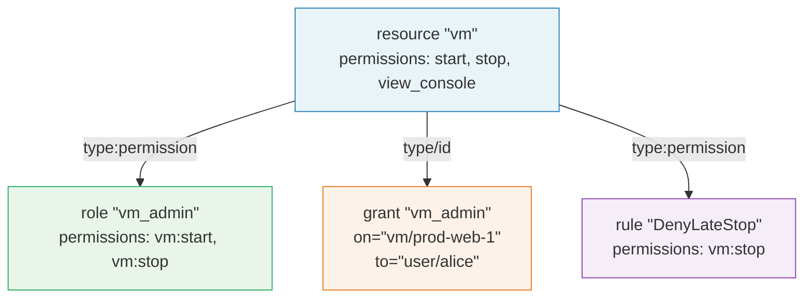

# Resources and Permissions

A `resource` node declares a type of object in your system and defines the relations and permissions that apply to it. Resources are the foundation of the authorization model -- every permission check ultimately references a resource type and one of its declared permissions.

## Syntax

```kdl
resource "<type_name>" {
    relations {
        - "<relation_name>"
        // ...
    }
    permissions {
        - "<permission_name>"
        // ...
    }
}
```

### Components

| Component | Required | Description |
|-----------|----------|-------------|
| `type_name` | Yes | A unique identifier for this resource type (e.g., `"vm"`, `"document"`, `"invoice"`). Used in fully-qualified permission names and object references. |
| `relations` | No | A block listing the named relationships that can exist between principals and instances of this resource type. |
| `permissions` | No | A block listing the actions that can be performed on instances of this resource type. |

Both `relations` and `permissions` use KDL's list-child syntax where each item is a `-` node with a string argument.

## Relations

Relations define the types of relationships that can exist between a principal (user, group, service) and a resource instance. They are used in [grants](./grants-tuples.md) to specify the nature of a principal's connection to a resource.

```kdl
resource "repository" {
    relations {
        - "owner"
        - "maintainer"
        - "contributor"
        - "reader"
    }
}
```

Relation names are arbitrary strings. Common conventions include:

| Pattern | Examples | Use Case |
|---------|----------|----------|
| Role-like names | `owner`, `admin`, `viewer` | Hierarchical access levels |
| Organizational names | `member`, `manager`, `team_lead` | Team structure relationships |
| Functional names | `assignee`, `reviewer`, `approver` | Workflow-specific relationships |

Relations declared on a resource do not by themselves grant any permissions. They serve as labels for the relationship tuples created by `grant` nodes. The mapping from relations to permissions is handled by [roles](./roles-inheritance.md).

## Permissions

Permissions define the actions that can be performed on instances of a resource type. Each permission is a simple string that describes a single, atomic operation.

```kdl
resource "vm" {
    permissions {
        - "start"
        - "stop"
        - "restart"
        - "view_console"
        - "snapshot"
        - "delete"
    }
}
```

### Naming Conventions

Permission names should be short, descriptive verbs or verb phrases. Use underscores to separate words:

| Good | Avoid |
|------|-------|
| `read` | `can_read` |
| `write` | `has_write_access` |
| `view_console` | `console_viewing_permission` |
| `manage_members` | `member-management` |

## Fully-Qualified Permission Names

Outside of the `resource` block, permissions are referenced using the fully-qualified format:

```
<resource_type>:<permission_name>
```

For example, a resource defined as:

```kdl
resource "vm" {
    permissions {
        - "start"
        - "stop"
    }
}
```

produces the fully-qualified permissions:

- `vm:start`
- `vm:stop`

These fully-qualified names are used in three places:

1. **Role definitions**: `role` nodes reference permissions as `"vm:start"` in their `permissions` block.
2. **Rule definitions**: `rule` nodes reference permissions as `"vm:start"` in their `permissions` block.
3. **Check requests**: The `permission` field in a check request uses the fully-qualified format: `{ "permission": "vm:start" }`.

## Object References

When a check request or grant refers to a specific instance of a resource, it uses the **ObjectRef** format:

```
<resource_type>/<instance_id>
```

For example:

| ObjectRef | Resource Type | Instance ID |
|-----------|--------------|-------------|
| `vm/prod-web-1` | `vm` | `prod-web-1` |
| `document/quarterly-report` | `document` | `quarterly-report` |
| `repository/barycenter` | `repository` | `barycenter` |

The resource type in an ObjectRef must match a declared `resource` node. The instance ID is an opaque string that identifies a specific object in your system.

## Examples

### Infrastructure Resources

```kdl
resource "vm" {
    relations {
        - "owner"
        - "viewer"
    }
    permissions {
        - "start"
        - "stop"
        - "restart"
        - "view_console"
        - "snapshot"
        - "resize"
        - "delete"
    }
}

resource "network" {
    relations {
        - "admin"
        - "member"
    }
    permissions {
        - "create_subnet"
        - "delete_subnet"
        - "attach_vm"
        - "detach_vm"
        - "view"
    }
}
```

### SaaS Application Resources

```kdl
resource "workspace" {
    relations {
        - "owner"
        - "admin"
        - "member"
        - "guest"
    }
    permissions {
        - "manage_billing"
        - "manage_members"
        - "create_project"
        - "view"
    }
}

resource "project" {
    relations {
        - "manager"
        - "contributor"
        - "viewer"
    }
    permissions {
        - "create_task"
        - "assign_task"
        - "delete"
        - "archive"
        - "view"
    }
}
```

### Document Management Resources

```kdl
resource "document" {
    relations {
        - "owner"
        - "editor"
        - "commenter"
        - "viewer"
    }
    permissions {
        - "read"
        - "write"
        - "comment"
        - "share"
        - "delete"
        - "manage_permissions"
    }
}

resource "folder" {
    relations {
        - "owner"
        - "editor"
        - "viewer"
    }
    permissions {
        - "list"
        - "create_document"
        - "delete"
        - "rename"
    }
}
```

## Relationship to Other Node Types

Resources are referenced by all other node types in the policy language:



- **Roles** reference resource permissions using the fully-qualified `type:permission` format.
- **Grants** reference resource instances using the `type/id` ObjectRef format.
- **Rules** reference resource permissions using the fully-qualified `type:permission` format.

## Further Reading

- [Roles and Inheritance](./roles-inheritance.md) -- grouping permissions into reusable roles
- [Grants and Relationship Tuples](./grants-tuples.md) -- assigning roles to specific resource instances
- [ABAC Rules and Conditions](./abac-rules.md) -- conditional policies referencing resource permissions
