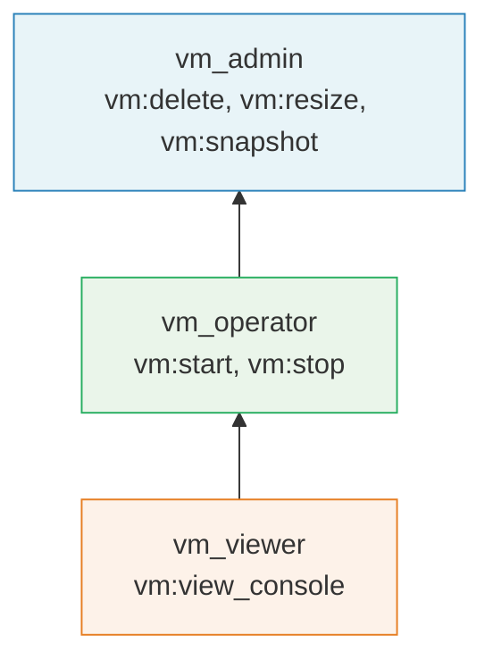

# Roles and Inheritance

A `role` node groups fully-qualified permissions together under a named identity and optionally inherits permissions from other roles. Roles are the bridge between the abstract permissions declared on [resources](./resources-permissions.md) and the concrete [grants](./grants-tuples.md) that assign those permissions to principals.

## Syntax

```kdl
role "<role_name>" {
    includes {
        - "<parent_role_name>"
        // ...
    }
    permissions {
        - "<resource_type>:<permission_name>"
        // ...
    }
}
```

### Components

| Component | Required | Description |
|-----------|----------|-------------|
| `role_name` | Yes | A unique identifier for this role (e.g., `"vm_admin"`, `"document_editor"`). Referenced by `grant` nodes. |
| `includes` | No | A block listing other role names whose permissions this role inherits. |
| `permissions` | No | A block listing fully-qualified permissions (`type:permission`) that this role directly grants. |

A role with neither `includes` nor `permissions` is valid but has no effect.

## Fully-Qualified Permissions

Permissions in a role block use the fully-qualified format `resource_type:permission_name`, which references a permission declared on a `resource` node:

```kdl
// The resource declaration
resource "vm" {
    permissions {
        - "start"
        - "stop"
        - "view_console"
    }
}

// The role references those permissions
role "vm_operator" {
    permissions {
        - "vm:start"
        - "vm:stop"
    }
}
```

A role can include permissions from multiple resource types:

```kdl
role "infrastructure_admin" {
    permissions {
        - "vm:start"
        - "vm:stop"
        - "vm:delete"
        - "network:create_subnet"
        - "network:delete_subnet"
    }
}
```

## Role Inheritance

The `includes` block allows a role to inherit all permissions from one or more parent roles. This creates a hierarchy where more privileged roles build on top of less privileged ones.

### Basic Inheritance

```kdl
role "vm_viewer" {
    permissions {
        - "vm:view_console"
    }
}

role "vm_operator" {
    includes {
        - "vm_viewer"
    }
    permissions {
        - "vm:start"
        - "vm:stop"
    }
}

role "vm_admin" {
    includes {
        - "vm_operator"
    }
    permissions {
        - "vm:delete"
        - "vm:resize"
        - "vm:snapshot"
    }
}
```

In this example, the effective permissions for each role are:

| Role | Direct Permissions | Inherited Permissions | Effective Permissions |
|------|-------------------|----------------------|----------------------|
| `vm_viewer` | `vm:view_console` | -- | `vm:view_console` |
| `vm_operator` | `vm:start`, `vm:stop` | `vm:view_console` | `vm:view_console`, `vm:start`, `vm:stop` |
| `vm_admin` | `vm:delete`, `vm:resize`, `vm:snapshot` | `vm:view_console`, `vm:start`, `vm:stop` | All six permissions |

### Transitive Inheritance

Inheritance is transitive. If role A includes role B, and role B includes role C, then role A inherits all permissions from both B and C:



The arrows point from child to parent to indicate the direction of permission flow: permissions flow upward from base roles to more privileged roles.

### Multiple Inheritance

A role can include multiple parent roles, merging their permissions:

```kdl
role "vm_viewer" {
    permissions {
        - "vm:view_console"
    }
}

role "network_viewer" {
    permissions {
        - "network:view"
    }
}

role "infrastructure_viewer" {
    includes {
        - "vm_viewer"
        - "network_viewer"
    }
}
```

The `infrastructure_viewer` role effectively holds both `vm:view_console` and `network:view`.

### Diamond Inheritance

If multiple included roles share a common ancestor, the shared permissions are deduplicated. There is no double-counting or ambiguity:

```kdl
role "base" {
    permissions {
        - "vm:view_console"
    }
}

role "operator" {
    includes {
        - "base"
    }
    permissions {
        - "vm:start"
    }
}

role "auditor" {
    includes {
        - "base"
    }
    permissions {
        - "vm:snapshot"
    }
}

role "super_admin" {
    includes {
        - "operator"
        - "auditor"
    }
}
```

The `super_admin` role holds `vm:view_console`, `vm:start`, and `vm:snapshot` -- the `vm:view_console` permission from `base` appears only once.

## Pre-Computed Permission Map

At startup, the engine resolves all inheritance chains and builds a `permission_roles` map: a `HashMap<String, Vec<String>>` that maps each fully-qualified permission to the list of roles that grant it (directly or through inheritance).

For the basic inheritance example above, the pre-computed map would contain:

| Permission | Roles Granting It |
|------------|------------------|
| `vm:view_console` | `vm_viewer`, `vm_operator`, `vm_admin` |
| `vm:start` | `vm_operator`, `vm_admin` |
| `vm:stop` | `vm_operator`, `vm_admin` |
| `vm:delete` | `vm_admin` |
| `vm:resize` | `vm_admin` |
| `vm:snapshot` | `vm_admin` |

This pre-computation happens once during policy loading. At evaluation time, when a check request asks "does the principal have permission `vm:start` on resource `vm/prod-web-1`?", the engine looks up `vm:start` in the `permission_roles` map to find all roles that grant it, then checks the tuple index for grants matching any of those roles on the specified resource for the given principal.

This design means that role inheritance has zero cost at evaluation time -- all the resolution work is done upfront.

## Design Patterns

### Layered Access Levels

A common pattern is to define a hierarchy of access levels for each resource type:

```kdl
role "project_viewer" {
    permissions {
        - "project:view"
    }
}

role "project_contributor" {
    includes {
        - "project_viewer"
    }
    permissions {
        - "project:create_task"
    }
}

role "project_manager" {
    includes {
        - "project_contributor"
    }
    permissions {
        - "project:assign_task"
        - "project:archive"
    }
}

role "project_owner" {
    includes {
        - "project_manager"
    }
    permissions {
        - "project:delete"
        - "project:manage_members"
    }
}
```

### Cross-Resource Roles

For roles that span multiple resource types, use a descriptive name that indicates the broader scope:

```kdl
role "workspace_admin" {
    includes {
        - "project_owner"
        - "document_admin"
    }
    permissions {
        - "workspace:manage_billing"
        - "workspace:manage_members"
    }
}
```

### Separation of Duties

Roles can be designed to enforce separation of duties by keeping certain permission sets in distinct, non-overlapping roles:

```kdl
role "payment_initiator" {
    permissions {
        - "payment:create"
        - "payment:view"
    }
}

role "payment_approver" {
    permissions {
        - "payment:approve"
        - "payment:reject"
        - "payment:view"
    }
}

// No role includes both "create" and "approve"
```

## Further Reading

- [Resources and Permissions](./resources-permissions.md) -- declaring the permissions that roles reference
- [Grants and Relationship Tuples](./grants-tuples.md) -- assigning roles to principals on resources
- [Overview](./overview.md) -- how roles fit into the evaluation pipeline
