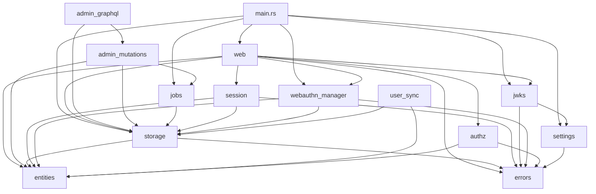

# Module Structure

Barycenter's source code is organized into focused modules declared in `src/lib.rs`. Each module handles a specific concern, and together they compose the complete identity provider.

## Module Overview

| Module | Description |
|--------|-------------|
| `admin_graphql` | GraphQL schema building and admin API router. Defines the GraphQL schema, attaches it to a dedicated Axum router, and serves the admin API on a separate port. |
| `admin_mutations` | Custom GraphQL mutations and queries for administrative operations. Includes job triggering, user 2FA management, and job log queries. |
| `authz` | Authorization policy engine. Evaluates access control policies with a modular architecture of sub-modules. |
| `entities` | SeaORM entity definitions for all 12 database tables. Auto-generated by `sea-orm-cli` and customized as needed. |
| `errors` | `CrabError` enum for centralized error handling. Provides conversions from common error types and miette diagnostic annotations. |
| `jobs` | Background job scheduler. Manages periodic cleanup tasks for expired sessions, refresh tokens, and WebAuthn challenges. |
| `jwks` | JWKS and JWT key management. Handles RSA key generation, persistence, public key publication, and JWT signing with RS256. |
| `session` | Session cookie handling. Manages session creation, validation, expiration, and the session cookie attributes (HttpOnly, SameSite, Secure). |
| `settings` | Configuration loading. Merges defaults, config file values, and environment variables into the `Settings` struct. |
| `storage` | Database operations. Provides functions for CRUD operations on all entity types using SeaORM's `DatabaseConnection`. |
| `user_sync` | User synchronization from JSON. Imports or updates user records from an external JSON source. |
| `web` | HTTP endpoints and middleware. Defines all Axum routes, request handlers, security header middleware, and static file serving. |
| `webauthn_manager` | WebAuthn/passkey operations. Manages passkey registration, authentication, and two-factor verification flows. |

## Authorization Policy Engine (`authz`)

The `authz` module has its own internal structure with the following sub-modules:

| Sub-Module | Description |
|------------|-------------|
| `condition` | Defines conditions that can be evaluated against a request context |
| `engine` | The policy evaluation engine that processes policies against requests |
| `errors` | Authorization-specific error types |
| `loader` | Loads policy definitions from configuration or storage |
| `policy` | Policy data structures and definitions |
| `types` | Shared type definitions used across the authorization module |
| `web` | HTTP endpoints for the authorization policy service |

## AppState

The `AppState` struct is the central shared state passed to all request handlers:

```rust
pub struct AppState {
    pub settings: Arc<Settings>,
    pub db: DatabaseConnection,
    pub jwks: JwksManager,
    pub webauthn: WebAuthnManager,
}
```

| Field | Description |
|-------|-------------|
| `settings` | Application configuration wrapped in `Arc` for shared access across threads |
| `db` | SeaORM database connection (connection pool for PostgreSQL, single connection for SQLite) |
| `jwks` | Manages RSA keys for JWT signing and JWKS endpoint serving |
| `webauthn` | Manages WebAuthn ceremonies (registration, authentication, 2FA) |

## Dependency Graph

The following diagram shows how modules depend on each other. Arrows point from the dependent module to the module it uses.



## Key Patterns

### Shared State via Axum Extractors

All request handlers receive `AppState` through Axum's `State` extractor:

```rust
async fn handle_token(
    State(state): State<Arc<AppState>>,
    Form(params): Form<TokenRequest>,
) -> Result<Json<TokenResponse>, CrabError> {
    // Access state.db, state.jwks, state.settings, etc.
}
```

### Module Encapsulation

Each module exposes a public API that other modules consume. Internal implementation details are kept private. For example:

- `storage` exposes functions like `store_auth_code()` and `get_client()` but hides the SQL queries.
- `jwks` exposes `sign_jwt_rs256()` but hides the key loading and caching logic.
- `session` exposes `create_session()` and `validate_session()` but hides cookie parsing.

### Entity-Based Data Access

All database operations go through SeaORM entities defined in the `entities` module. Direct SQL queries are avoided in favor of SeaORM's query builder and entity model patterns. This provides type safety, database-agnostic queries, and compile-time validation of column references.
