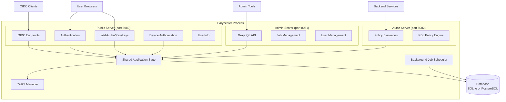
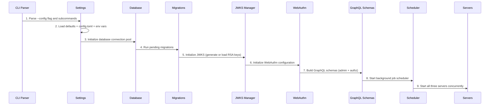

# Architecture

Barycenter uses a three-port architecture where each port serves a distinct role. All three servers share a single database connection pool, JWKS manager, and application state.

## Three-Port Design

### Public Server (default port 8080)

The public server handles all user-facing and client-facing OIDC operations:

- **Discovery**: `/.well-known/openid-configuration` and `/.well-known/jwks.json`
- **Client Registration**: `POST /connect/register`
- **Authorization**: `GET /authorize` with PKCE enforcement
- **Token Exchange**: `POST /token` (authorization code, refresh token, device code grants)
- **Token Revocation**: `POST /revoke`
- **UserInfo**: `GET /userinfo`
- **Authentication**: Login pages, password verification, WebAuthn flows
- **Device Authorization**: `POST /device/authorize` and `GET /device` verification page
- **Consent**: User consent approval and tracking

### Admin Server (default port 8081)

The admin server exposes a GraphQL API on the port immediately following the public port. It is intended for internal management and should not be exposed to the public internet.

- **User Management**: Query users, set 2FA requirements
- **Job Control**: Trigger background jobs manually, view execution history
- **System Queries**: List available jobs, check user status

### Authorization Policy Server (default port 8082)

The authorization policy server runs on the second port after the public port. It evaluates access control decisions using KDL-defined policies.

- **Policy Evaluation**: HTTP API for checking authorization decisions
- **ReBAC + ABAC**: Combines relationship-based and attribute-based access control

## Technology Stack

| Component | Technology | Purpose |
|-----------|-----------|---------|
| Language | Rust (stable) | Systems language with memory safety |
| Web framework | [axum](https://github.com/tokio-rs/axum) | Async HTTP framework built on tokio and hyper |
| Database ORM | [SeaORM](https://www.sea-ql.org/SeaORM/) | Async ORM supporting SQLite and PostgreSQL |
| JWT/JOSE | [josekit](https://github.com/nickel-org/josekit-rs) | JSON Web Token creation and signing |
| WebAuthn | [webauthn-rs](https://github.com/kanidm/webauthn-rs) | FIDO2/WebAuthn server implementation |
| GraphQL | [async-graphql](https://github.com/async-graphql/async-graphql) | GraphQL server for the admin API |
| Scheduling | [tokio-cron-scheduler](https://github.com/mvniekerk/tokio-cron-scheduler) | Cron-based background job scheduling |
| Password hashing | argon2 | Memory-hard password hashing |
| Configuration | config-rs + TOML | Layered configuration with file and environment support |
| WASM client | wasm-pack + wasm-bindgen | Browser-side WebAuthn operations |

## Startup Sequence

When Barycenter starts, it follows this initialization order:

1. **Parse CLI**: Read `--config` path and any subcommands (e.g., `sync-users --file`)
2. **Load settings**: Merge default values, configuration file, and environment variables
3. **Initialize database**: Create connection pool to SQLite or PostgreSQL
4. **Run migrations**: Apply any pending schema migrations automatically
5. **Initialize JWKS**: Generate a 2048-bit RSA key pair on first run, or load existing keys from disk
6. **Initialize WebAuthn**: Configure the WebAuthn relying party based on the server's public URL
7. **Build GraphQL schemas**: Construct the async-graphql schemas for admin and authorization APIs
8. **Start scheduler**: Register cron jobs for cleanup of sessions, tokens, and challenges
9. **Start servers**: Launch all three HTTP servers concurrently on their respective ports

All three servers share the same tokio runtime and application state. If any server fails to bind its port, the entire process exits with an error.
