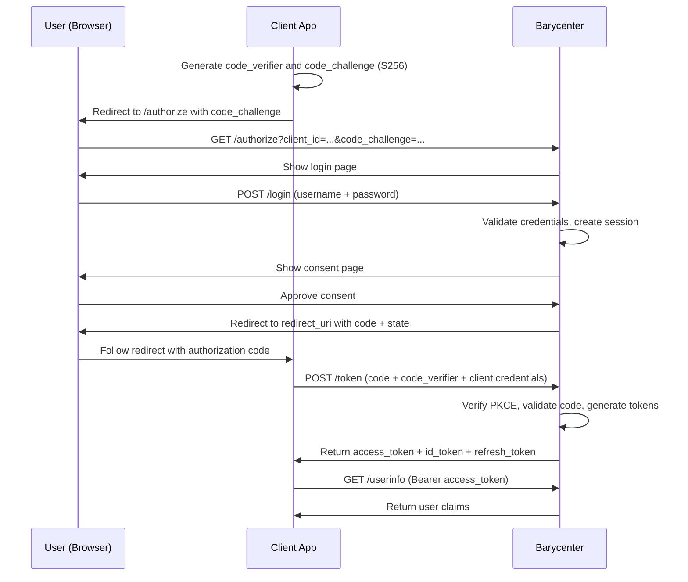

# Quickstart

This guide walks through a complete OIDC Authorization Code flow with Barycenter -- from starting the server to obtaining an ID token. By the end, you will have registered a client, authenticated a user, and exchanged an authorization code for tokens.

## Prerequisites

- Barycenter is [installed](./installation.md) and ready to run
- `curl` and `openssl` are available on your system
- A web browser for the authentication step

## 1. Start the Server

```bash
cargo run
```

Or with the release binary:

```bash
./target/release/barycenter --config config.toml
```

Barycenter starts three servers:

```
INFO  Public server listening on 0.0.0.0:8080
INFO  Admin server listening on 0.0.0.0:8081
INFO  Authz server listening on 0.0.0.0:8082
```

A default test user is available: username `admin`, password `password123`.

## 2. Verify the Server Is Running

Check the OIDC discovery document:

```bash
curl -s http://localhost:8080/.well-known/openid-configuration | python3 -m json.tool
```

You should see the provider metadata including the authorization, token, and userinfo endpoints.

## 3. Register a Client

Use dynamic client registration to create an OAuth client:

```bash
curl -s -X POST http://localhost:8080/connect/register \
  -H "Content-Type: application/json" \
  -d '{
    "redirect_uris": ["http://localhost:8080/callback"],
    "client_name": "Quickstart Client"
  }' | python3 -m json.tool
```

Save the `client_id` and `client_secret` from the response:

```json
{
  "client_id": "aBcDeFgHiJkLmNoPqRsTuVwX",
  "client_secret": "sEcReTvAlUeHeRe...",
  "redirect_uris": ["http://localhost:8080/callback"],
  "client_name": "Quickstart Client",
  "token_endpoint_auth_method": "client_secret_basic"
}
```

Set them as shell variables for the following steps:

```bash
CLIENT_ID="<your client_id>"
CLIENT_SECRET="<your client_secret>"
```

## 4. Generate PKCE Parameters

Barycenter requires PKCE (S256) for all authorization requests.

```bash
# Generate a random code verifier
CODE_VERIFIER=$(openssl rand -base64 32 | tr -d '=' | tr '+/' '-_')

# Derive the code challenge (S256)
CODE_CHALLENGE=$(echo -n "$CODE_VERIFIER" | openssl dgst -binary -sha256 | base64 | tr -d '=' | tr '+/' '-_')

# Generate a random state parameter
STATE=$(openssl rand -hex 16)

echo "Code Verifier:  $CODE_VERIFIER"
echo "Code Challenge: $CODE_CHALLENGE"
echo "State:          $STATE"
```

## 5. Open the Authorization URL

Construct the authorization URL and open it in your browser:

```bash
AUTH_URL="http://localhost:8080/authorize?\
client_id=${CLIENT_ID}&\
redirect_uri=http://localhost:8080/callback&\
response_type=code&\
scope=openid&\
code_challenge=${CODE_CHALLENGE}&\
code_challenge_method=S256&\
state=${STATE}"

echo "$AUTH_URL"
```

Open the printed URL in your browser. You will be presented with the login page.

## 6. Authenticate

Log in with the default test credentials:

- **Username:** `admin`
- **Password:** `password123`

After successful authentication and consent, the browser will redirect to the callback URL with an authorization code in the query string:

```
http://localhost:8080/callback?code=AUTH_CODE_HERE&state=YOUR_STATE
```

Copy the `code` parameter from the URL bar. The redirect will likely show an error page since there is no application listening at `/callback` -- that is expected. The authorization code in the URL is what you need.

```bash
AUTH_CODE="<code from the redirect URL>"
```

## 7. Exchange the Code for Tokens

Exchange the authorization code for an access token and ID token:

```bash
curl -s -X POST http://localhost:8080/token \
  -H "Content-Type: application/x-www-form-urlencoded" \
  -u "${CLIENT_ID}:${CLIENT_SECRET}" \
  -d "grant_type=authorization_code" \
  -d "code=${AUTH_CODE}" \
  -d "redirect_uri=http://localhost:8080/callback" \
  -d "code_verifier=${CODE_VERIFIER}" | python3 -m json.tool
```

The response contains your tokens:

```json
{
  "access_token": "eyJhbGci...",
  "token_type": "Bearer",
  "expires_in": 3600,
  "id_token": "eyJhbGci...",
  "refresh_token": "dGhpcyBp..."
}
```

## 8. Inspect the ID Token

The ID token is a JWT. You can decode the payload to see the claims:

```bash
echo "$ID_TOKEN" | cut -d'.' -f2 | base64 -d 2>/dev/null | python3 -m json.tool
```

Expected claims:

```json
{
  "iss": "http://localhost:8080",
  "sub": "user-subject-id",
  "aud": "your-client-id",
  "exp": 1234567890,
  "iat": 1234564290,
  "auth_time": 1234564290,
  "amr": ["pwd"],
  "acr": "aal1",
  "at_hash": "base64url-encoded-hash"
}
```

## 9. Call the UserInfo Endpoint

Use the access token to retrieve user claims:

```bash
ACCESS_TOKEN="<access_token from the token response>"

curl -s http://localhost:8080/userinfo \
  -H "Authorization: Bearer ${ACCESS_TOKEN}" | python3 -m json.tool
```

## Complete Flow Diagram



## What's Next

- [Configuration](./configuration.md) -- Customize ports, database, key paths, and more.
- Authentication -- Learn about passkey login and two-factor authentication.
- OpenID Connect -- Explore client registration options, token claims, and discovery metadata.
- Admin API -- Manage users and background jobs via GraphQL.
