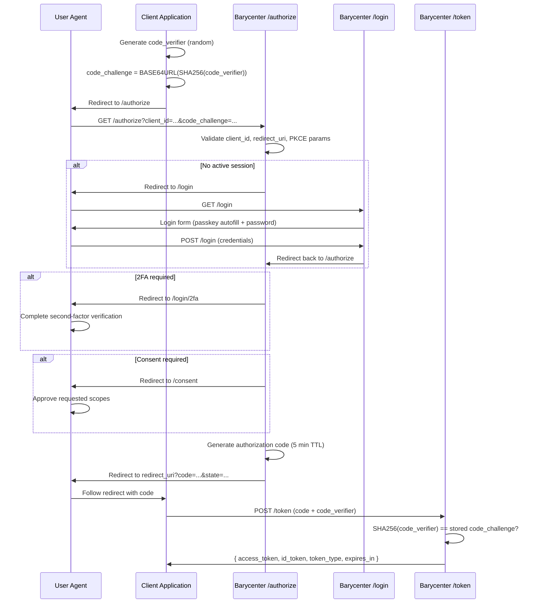

# Authorization Code Flow with PKCE

Barycenter implements the OAuth 2.0 Authorization Code flow as defined in [RFC 6749 Section 4.1](https://datatracker.ietf.org/doc/html/rfc6749#section-4.1), extended with Proof Key for Code Exchange (PKCE) as defined in [RFC 7636](https://datatracker.ietf.org/doc/html/rfc7636). PKCE with the S256 challenge method is **required** for all authorization requests.

## Flow Overview



## Authorization Endpoint

```
GET /authorize
```

### Required Parameters

| Parameter | Type | Description |
|---|---|---|
| `client_id` | string | The client identifier issued during [registration](./client-registration.md). |
| `redirect_uri` | string | Must exactly match one of the URIs registered for the client. |
| `response_type` | string | The requested response type. See [supported values](#response-types) below. |
| `scope` | string | Space-delimited list of scopes. **Must include `openid`**. |
| `code_challenge` | string | The PKCE code challenge, derived from the code verifier. |
| `code_challenge_method` | string | **Must be `S256`**. The plain method is not supported. |

### Optional Parameters

| Parameter | Type | Description |
|---|---|---|
| `state` | string | Opaque value to maintain state between request and callback. Returned unchanged in the redirect. Strongly recommended for CSRF protection. |
| `nonce` | string | Value to associate with the ID Token. Included as a claim in the issued ID Token for replay protection. |
| `prompt` | string | Controls the authentication UX. One of: `none`, `login`, `consent`, `select_account`. |
| `display` | string | How the authorization page is displayed. Informational; Barycenter serves standard HTML. |
| `ui_locales` | string | Space-separated list of preferred locales (BCP 47). |
| `claims_locales` | string | Space-separated list of preferred locales for claims. |
| `max_age` | integer | Maximum authentication age in seconds. If the user's last authentication is older than this value, re-authentication is required. Values below 300 trigger 2FA. |
| `acr_values` | string | Space-separated list of requested Authentication Context Class Reference values. |

### Response Types

| Value | Description |
|---|---|
| `code` | Authorization Code flow. Returns an authorization code in the redirect URI query parameters. This is the primary and recommended flow. |
| `id_token` | Implicit flow returning only an ID Token in the fragment. |
| `id_token token` | Implicit flow returning both an ID Token and an access token in the fragment. |

For nearly all use cases, `response_type=code` with PKCE is the correct choice. The implicit response types are provided for compatibility but are not recommended for new integrations.

## PKCE (Proof Key for Code Exchange)

PKCE prevents authorization code interception attacks. Barycenter enforces PKCE on every authorization request.

### How S256 Works

1. **Generate a code verifier**: a cryptographically random string between 43 and 128 characters, using the unreserved character set (`[A-Za-z0-9\-._~]`).

2. **Derive the code challenge**: compute `BASE64URL(SHA-256(code_verifier))`.

3. **Send the challenge** in the authorization request via `code_challenge` and `code_challenge_method=S256`.

4. **Send the verifier** when exchanging the authorization code at the token endpoint via `code_verifier`.

5. **Server verifies**: Barycenter computes `BASE64URL(SHA-256(code_verifier))` and compares it to the stored `code_challenge`. The token is issued only if they match.

### Example: Generating PKCE Values

```bash
# Generate a random code verifier (43+ chars, base64url, no padding)
code_verifier=$(openssl rand -base64 32 | tr -d '=' | tr '+/' '-_')
echo "code_verifier: $code_verifier"

# Derive the code challenge (SHA-256, base64url, no padding)
code_challenge=$(printf '%s' "$code_verifier" \
  | openssl dgst -binary -sha256 \
  | base64 \
  | tr -d '=' \
  | tr '+/' '-_')
echo "code_challenge: $code_challenge"
```

## Validation Rules

When Barycenter receives a request to `/authorize`, it performs the following checks in order:

1. **`client_id` exists** -- the client must be registered. If not, an error is returned directly (not via redirect).
2. **`redirect_uri` exact match** -- the provided URI must exactly match one of the client's registered redirect URIs. If not, an error is returned directly.
3. **`scope` includes `openid`** -- the `openid` scope is mandatory for all OIDC requests.
4. **`code_challenge_method` is `S256`** -- the `plain` method is rejected.
5. **`code_challenge` is present** -- PKCE is not optional.
6. **Session state** -- if the user has no active session, they are redirected to `/login`. After authentication, the flow resumes.
7. **2FA requirement** -- if the user has admin-enforced 2FA, if the requested scopes include high-value scopes (`admin`, `payment`, `transfer`, `delete`), or if `max_age` is below 300 seconds, the user is redirected to `/login/2fa`.
8. **Consent** -- if consent has not been previously granted for the requested scopes, the user is redirected to `/consent`.

## Authorization Code

When all checks pass, Barycenter generates an authorization code:

- **Format**: 24 cryptographically random bytes, base64url-encoded.
- **TTL**: 5 minutes. Codes that are not exchanged within this window expire.
- **Single-use**: once exchanged at the token endpoint, the code is marked as consumed. Attempting to reuse it will fail.
- **Bound data**: the code is associated with the client_id, redirect_uri, scope, PKCE challenge, subject, and nonce.

The user agent is redirected to the client's `redirect_uri` with the code and (if provided) the state:

```
HTTP/1.1 302 Found
Location: https://client.example.com/callback?code=abc123...&state=xyz
```

## Error Responses

Errors that occur **before** redirect_uri validation (invalid client_id, missing or non-matching redirect_uri) are displayed directly to the user. All other errors are returned as query parameters on the redirect URI per [RFC 6749 Section 4.1.2.1](https://datatracker.ietf.org/doc/html/rfc6749#section-4.1.2.1).

| Error Code | Condition |
|---|---|
| `invalid_request` | Missing required parameter, unsupported parameter value, or malformed request. |
| `unauthorized_client` | The client is not authorized for the requested response type or grant type. |
| `access_denied` | The user denied the authorization request. |
| `unsupported_response_type` | The `response_type` value is not supported. |
| `invalid_scope` | The requested scope is invalid, unknown, or missing `openid`. |
| `server_error` | An unexpected internal error occurred. |
| `temporarily_unavailable` | The server is temporarily unable to handle the request. |

Example error redirect:

```
HTTP/1.1 302 Found
Location: https://client.example.com/callback?error=invalid_scope&error_description=The+openid+scope+is+required&state=xyz
```

## Complete Example

```bash
# 1. Generate PKCE values
code_verifier=$(openssl rand -base64 32 | tr -d '=' | tr '+/' '-_')
code_challenge=$(printf '%s' "$code_verifier" \
  | openssl dgst -binary -sha256 | base64 | tr -d '=' | tr '+/' '-_')

# 2. Direct the user to the authorization endpoint
# (open this URL in a browser)
echo "https://idp.example.com/authorize?\
client_id=my_client_id&\
redirect_uri=https://app.example.com/callback&\
response_type=code&\
scope=openid%20profile%20email&\
code_challenge=${code_challenge}&\
code_challenge_method=S256&\
state=random_state_value&\
nonce=random_nonce_value"

# 3. After the user authenticates and consents, extract the code from
#    the redirect: https://app.example.com/callback?code=AUTH_CODE&state=random_state_value

# 4. Exchange the code for tokens (see Token Endpoint documentation)
curl -X POST https://idp.example.com/token \
  -H "Content-Type: application/x-www-form-urlencoded" \
  -d "grant_type=authorization_code" \
  -d "code=AUTH_CODE" \
  -d "redirect_uri=https://app.example.com/callback" \
  -d "client_id=my_client_id" \
  -d "client_secret=my_client_secret" \
  -d "code_verifier=${code_verifier}"
```

## Next Steps

- [Token Endpoint](./token-endpoint.md) -- exchanging the authorization code for tokens.
- [Client Authentication](./client-authentication.md) -- how to authenticate at the token endpoint.
- [ID Token](./id-token.md) -- structure and claims of the issued ID Token.
