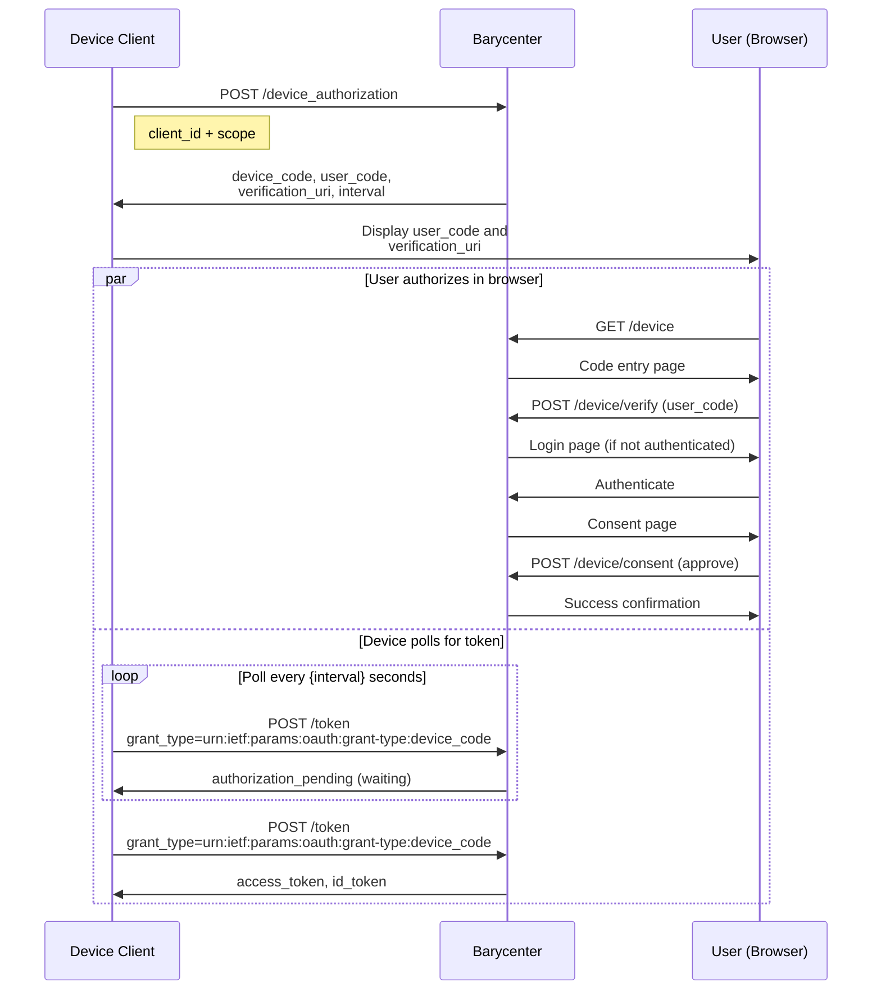

# Device Authorization Grant

Barycenter implements the OAuth 2.0 Device Authorization Grant as defined in [RFC 8628](https://datatracker.ietf.org/doc/html/rfc8628). This grant type enables authorization on input-constrained devices such as smart TVs, CLI tools, IoT devices, and other environments where the user cannot easily interact with a browser on the same device.

## Flow Overview

The device authorization grant involves three participants: the **device** (client application running on the constrained device), the **user** (who authorizes on a separate browser), and the **authorization server** (Barycenter).



## Step 1: Device Requests Authorization

The device initiates the flow by requesting a device code.

### Endpoint

```
POST /device_authorization
Content-Type: application/x-www-form-urlencoded
```

### Parameters

| Parameter | Type | Required | Description |
|---|---|---|---|
| `client_id` | string | Yes | The registered client identifier. |
| `scope` | string | No | Space-delimited list of requested scopes. Must include `openid` for OIDC. |

### Example Request

```bash
curl -X POST https://idp.example.com/device_authorization \
  -H "Content-Type: application/x-www-form-urlencoded" \
  -d "client_id=my_client_id" \
  -d "scope=openid%20profile"
```

### Response

```json
{
  "device_code": "ZGV2aWNlLWNvZGUtZXhhbXBsZS12YWx1ZQ",
  "user_code": "ABCD-1234",
  "verification_uri": "https://idp.example.com/device",
  "verification_uri_complete": "https://idp.example.com/device?user_code=ABCD-1234",
  "expires_in": 600,
  "interval": 5
}
```

| Field | Type | Description |
|---|---|---|
| `device_code` | string | The device verification code. Used by the device when polling the token endpoint. |
| `user_code` | string | A short, human-readable code displayed to the user. The user enters this on the verification page. |
| `verification_uri` | string | The URI the user should visit to enter the code. Display this to the user. |
| `verification_uri_complete` | string | The verification URI with the user_code pre-filled as a query parameter. Can be displayed as a QR code for convenience. |
| `expires_in` | integer | Lifetime of the device_code and user_code in seconds. |
| `interval` | integer | Minimum polling interval in seconds. The device must wait at least this long between token requests. |

## Step 2: User Authorizes in Browser

The device displays the `user_code` and `verification_uri` (or a QR code of `verification_uri_complete`) to the user. The user then:

### 2a. Opens the Verification Page

```
GET /device
```

The user navigates to the verification URI in a browser on any device (phone, laptop, etc.). Barycenter displays a page with a code entry form.

### 2b. Enters the User Code

```
POST /device/verify
Content-Type: application/x-www-form-urlencoded
```

| Parameter | Type | Required | Description |
|---|---|---|---|
| `user_code` | string | Yes | The code displayed on the device. |

If the user arrived via `verification_uri_complete`, the code is pre-filled.

After submitting the code, the user is redirected to authenticate (if not already logged in) and then to approve the authorization.

### 2c. Approves the Request

```
POST /device/consent
```

After authentication, the user reviews the requested scopes and approves or denies the request. On approval, the device code is marked as authorized, and the user sees a success confirmation page.

## Step 3: Device Polls for Token

While the user is authorizing in their browser, the device polls the token endpoint at regular intervals.

### Endpoint

```
POST /token
Content-Type: application/x-www-form-urlencoded
```

### Parameters

| Parameter | Type | Required | Description |
|---|---|---|---|
| `grant_type` | string | Yes | Must be `urn:ietf:params:oauth:grant-type:device_code`. |
| `device_code` | string | Yes | The device code received from the device authorization endpoint. |
| `client_id` | string | Yes | The client identifier. |

Client authentication (via [client_secret_basic or client_secret_post](./client-authentication.md)) is also required.

### Example Polling Request

```bash
curl -X POST https://idp.example.com/token \
  -u "my_client_id:my_client_secret" \
  -H "Content-Type: application/x-www-form-urlencoded" \
  -d "grant_type=urn:ietf:params:oauth:grant-type:device_code" \
  -d "device_code=ZGV2aWNlLWNvZGUtZXhhbXBsZS12YWx1ZQ" \
  -d "client_id=my_client_id"
```

### Polling Responses

The device will receive one of the following responses during polling:

#### Authorization Pending

The user has not yet completed authorization. Continue polling.

```json
{
  "error": "authorization_pending",
  "error_description": "The user has not yet authorized this device"
}
```

**HTTP Status: 400**

#### Slow Down

The device is polling too frequently. Increase the interval by 5 seconds.

```json
{
  "error": "slow_down",
  "error_description": "Polling too frequently, slow down"
}
```

**HTTP Status: 400**

#### Expired Token

The device code has expired. The device must restart the flow from Step 1.

```json
{
  "error": "expired_token",
  "error_description": "The device code has expired"
}
```

**HTTP Status: 400**

#### Access Denied

The user denied the authorization request.

```json
{
  "error": "access_denied",
  "error_description": "The user denied the authorization request"
}
```

**HTTP Status: 400**

#### Success

The user has authorized the device. Tokens are returned.

```json
{
  "access_token": "ZXhhbXBsZS1hY2Nlc3MtdG9rZW4",
  "token_type": "bearer",
  "expires_in": 3600,
  "id_token": "eyJhbGciOiJSUzI1NiIs...",
  "refresh_token": "ZXhhbXBsZS1yZWZyZXNoLXRva2Vu"
}
```

**HTTP Status: 200**

## Implementation Notes for Device Clients

### Polling Best Practices

```
initial_interval = response.interval  // e.g., 5 seconds

loop:
    wait(interval)
    response = POST /token with device_code
    if response.error == "authorization_pending":
        continue
    elif response.error == "slow_down":
        interval = interval + 5
        continue
    elif response.error == "expired_token":
        restart flow
    elif response.error == "access_denied":
        show error to user
        break
    elif response.access_token:
        store tokens
        break
```

### Displaying the Code

The device should display the `user_code` and `verification_uri` prominently:

```
To sign in, visit:

    https://idp.example.com/device

and enter code:

    ABCD-1234
```

If the device can display a QR code, encode `verification_uri_complete` as a QR code to allow the user to scan instead of typing.

## Related

- [Token Endpoint](./token-endpoint.md) -- overview of all grant types.
- [Client Registration](./client-registration.md) -- registering the device client.
- [Client Authentication](./client-authentication.md) -- authenticating token requests.
